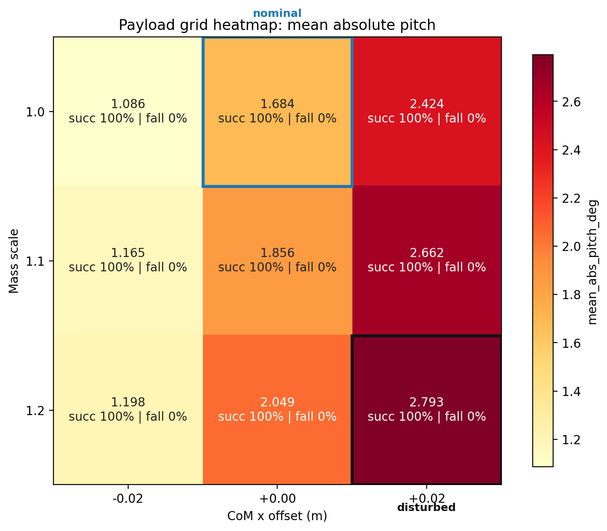
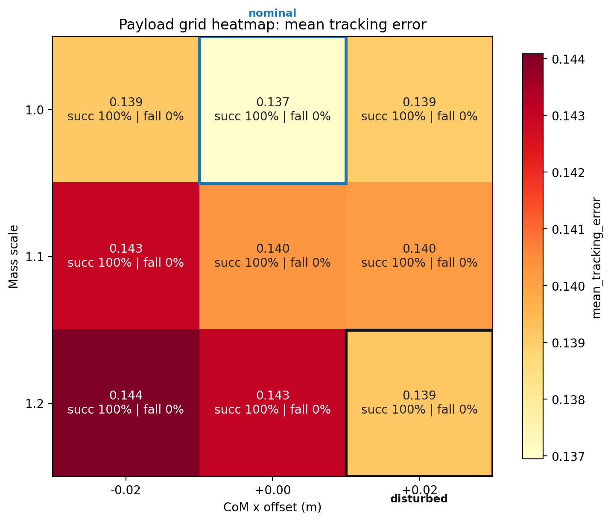
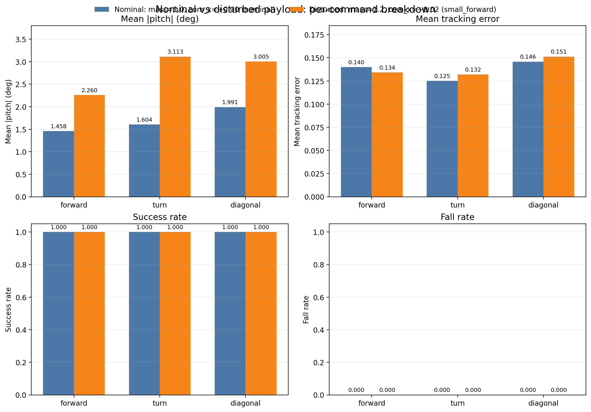

# Week 1 Payload Robustness Grid

## Scenario Summary

| scenario | mass_scale | com_x | mean_tracking_error | mean_abs_pitch_deg | peak_abs_pitch_deg | mean_action_rate_l2 | mean_torque_l2 | mean_abs_power | success_rate | fall_rate | survival_time_s |
|---|---|---|---|---|---|---|---|---|---|---|---|
| mass=1.0, com_x=-0.02 (small_backward) | 1.0 | -0.02 | 0.139 | 1.086 | 2.449 | 3.509 | 416.634 | 92.176 | 1.000 | 0.000 | 20.000 |
| mass=1.0, com_x=+0.00 (nominal) | 1.0 | 0.0 | 0.137 | 1.684 | 2.767 | 3.483 | 415.225 | 91.297 | 1.000 | 0.000 | 20.000 |
| mass=1.0, com_x=+0.02 (small_forward) | 1.0 | 0.02 | 0.139 | 2.424 | 3.526 | 3.508 | 413.145 | 91.151 | 1.000 | 0.000 | 20.000 |
| mass=1.1, com_x=-0.02 (small_backward) | 1.1 | -0.02 | 0.143 | 1.165 | 2.646 | 3.672 | 457.739 | 95.955 | 1.000 | 0.000 | 20.000 |
| mass=1.1, com_x=+0.00 (nominal) | 1.1 | 0.0 | 0.140 | 1.856 | 3.005 | 3.683 | 455.593 | 95.864 | 1.000 | 0.000 | 20.000 |
| mass=1.1, com_x=+0.02 (small_forward) | 1.1 | 0.02 | 0.140 | 2.662 | 3.885 | 3.663 | 453.809 | 94.944 | 1.000 | 0.000 | 20.000 |
| mass=1.2, com_x=-0.02 (small_backward) | 1.2 | -0.02 | 0.144 | 1.198 | 2.614 | 3.837 | 501.037 | 101.249 | 1.000 | 0.000 | 20.000 |
| mass=1.2, com_x=+0.00 (nominal) | 1.2 | 0.0 | 0.143 | 2.049 | 3.558 | 3.872 | 499.159 | 100.776 | 1.000 | 0.000 | 20.000 |
| mass=1.2, com_x=+0.02 (small_forward) | 1.2 | 0.02 | 0.139 | 2.793 | 4.510 | 3.868 | 493.627 | 99.805 | 1.000 | 0.000 | 20.000 |

## Figures

## Payload Audit

| scenario | nominal_base_mass | applied_base_mass | nominal_base_com_x | applied_base_com_x | applied_mass_scale_vs_nominal | applied_com_x_delta |
|---|---|---|---|---|---|---|
| mass=1.0, com_x=-0.02 (small_backward) | 6.921 | 6.921 | 0.021 | 0.001 | 1.000 | -0.020 |
| mass=1.0, com_x=+0.00 (nominal) | 6.921 | 6.921 | 0.021 | 0.021 | 1.000 | 0.000 |
| mass=1.0, com_x=+0.02 (small_forward) | 6.921 | 6.921 | 0.021 | 0.041 | 1.000 | 0.020 |
| mass=1.1, com_x=-0.02 (small_backward) | 6.921 | 7.613 | 0.021 | 0.001 | 1.100 | -0.020 |
| mass=1.1, com_x=+0.00 (nominal) | 6.921 | 7.613 | 0.021 | 0.021 | 1.100 | 0.000 |
| mass=1.1, com_x=+0.02 (small_forward) | 6.921 | 7.613 | 0.021 | 0.041 | 1.100 | 0.020 |
| mass=1.2, com_x=-0.02 (small_backward) | 6.921 | 8.305 | 0.021 | 0.001 | 1.200 | -0.020 |
| mass=1.2, com_x=+0.00 (nominal) | 6.921 | 8.305 | 0.021 | 0.021 | 1.200 | 0.000 |
| mass=1.2, com_x=+0.02 (small_forward) | 6.921 | 8.305 | 0.021 | 0.041 | 1.200 | 0.020 |

## Reference Pair

nominal: mass=1.0, com_x=+0.00 (nominal)
disturbed: mass=1.2, com_x=+0.02 (small_forward)

stable_degradation: True
has_degradation: True
no_collapse: True

## Per-Command Summary By Cell

## mass=1.0, com_x=-0.02 (small_backward)

| command | vx | vy | yaw | mean_tracking_error | mean_abs_roll_deg | mean_abs_pitch_deg | peak_abs_pitch_deg | mean_action_rate_l2 | mean_torque_l2 | mean_abs_power | fall_rate | survival_time_s | pass |
|---|---|---|---|---|---|---|---|---|---|---|---|---|---|
| forward | 0.8 | 0.0 | 0.0 | 0.138 | 1.172 | 0.842 | 2.060 | 4.399 | 430.944 | 106.251 | 0.000 | 20.000 | PASS |
| turn | 0.4 | 0.0 | 0.8 | 0.135 | 1.194 | 1.006 | 2.808 | 3.166 | 460.403 | 64.877 | 0.000 | 20.000 | PASS |
| diagonal | 0.5 | 0.3 | 0.0 | 0.144 | 2.746 | 1.410 | 2.480 | 2.961 | 358.556 | 105.401 | 0.000 | 20.000 | PASS |

## mass=1.0, com_x=+0.00 (nominal)

| command | vx | vy | yaw | mean_tracking_error | mean_abs_roll_deg | mean_abs_pitch_deg | peak_abs_pitch_deg | mean_action_rate_l2 | mean_torque_l2 | mean_abs_power | fall_rate | survival_time_s | pass |
|---|---|---|---|---|---|---|---|---|---|---|---|---|---|
| forward | 0.8 | 0.0 | 0.0 | 0.140 | 1.228 | 1.458 | 2.236 | 4.394 | 426.539 | 103.203 | 0.000 | 20.000 | PASS |
| turn | 0.4 | 0.0 | 0.8 | 0.125 | 1.179 | 1.604 | 3.519 | 3.083 | 457.237 | 66.198 | 0.000 | 20.000 | PASS |
| diagonal | 0.5 | 0.3 | 0.0 | 0.146 | 2.759 | 1.991 | 2.548 | 2.972 | 361.898 | 104.489 | 0.000 | 20.000 | PASS |

## mass=1.0, com_x=+0.02 (small_forward)

| command | vx | vy | yaw | mean_tracking_error | mean_abs_roll_deg | mean_abs_pitch_deg | peak_abs_pitch_deg | mean_action_rate_l2 | mean_torque_l2 | mean_abs_power | fall_rate | survival_time_s | pass |
|---|---|---|---|---|---|---|---|---|---|---|---|---|---|
| forward | 0.8 | 0.0 | 0.0 | 0.137 | 1.203 | 2.093 | 2.880 | 4.412 | 424.596 | 103.918 | 0.000 | 20.000 | PASS |
| turn | 0.4 | 0.0 | 0.8 | 0.129 | 1.082 | 2.610 | 4.458 | 3.098 | 448.537 | 64.992 | 0.000 | 20.000 | PASS |
| diagonal | 0.5 | 0.3 | 0.0 | 0.151 | 2.799 | 2.570 | 3.240 | 3.015 | 366.303 | 104.542 | 0.000 | 20.000 | PASS |

## mass=1.1, com_x=-0.02 (small_backward)

| command | vx | vy | yaw | mean_tracking_error | mean_abs_roll_deg | mean_abs_pitch_deg | peak_abs_pitch_deg | mean_action_rate_l2 | mean_torque_l2 | mean_abs_power | fall_rate | survival_time_s | pass |
|---|---|---|---|---|---|---|---|---|---|---|---|---|---|
| forward | 0.8 | 0.0 | 0.0 | 0.144 | 1.332 | 0.820 | 2.217 | 4.600 | 476.362 | 107.780 | 0.000 | 20.000 | PASS |
| turn | 0.4 | 0.0 | 0.8 | 0.138 | 1.294 | 1.119 | 3.256 | 3.333 | 503.748 | 69.073 | 0.000 | 20.000 | PASS |
| diagonal | 0.5 | 0.3 | 0.0 | 0.147 | 2.672 | 1.555 | 2.465 | 3.083 | 393.108 | 111.012 | 0.000 | 20.000 | PASS |

## mass=1.1, com_x=+0.00 (nominal)

| command | vx | vy | yaw | mean_tracking_error | mean_abs_roll_deg | mean_abs_pitch_deg | peak_abs_pitch_deg | mean_action_rate_l2 | mean_torque_l2 | mean_abs_power | fall_rate | survival_time_s | pass |
|---|---|---|---|---|---|---|---|---|---|---|---|---|---|
| forward | 0.8 | 0.0 | 0.0 | 0.142 | 1.333 | 1.550 | 2.355 | 4.620 | 471.249 | 106.517 | 0.000 | 20.000 | PASS |
| turn | 0.4 | 0.0 | 0.8 | 0.131 | 1.326 | 1.819 | 3.567 | 3.339 | 498.167 | 70.060 | 0.000 | 20.000 | PASS |
| diagonal | 0.5 | 0.3 | 0.0 | 0.148 | 2.721 | 2.200 | 3.093 | 3.091 | 397.363 | 111.016 | 0.000 | 20.000 | PASS |

## mass=1.1, com_x=+0.02 (small_forward)

| command | vx | vy | yaw | mean_tracking_error | mean_abs_roll_deg | mean_abs_pitch_deg | peak_abs_pitch_deg | mean_action_rate_l2 | mean_torque_l2 | mean_abs_power | fall_rate | survival_time_s | pass |
|---|---|---|---|---|---|---|---|---|---|---|---|---|---|
| forward | 0.8 | 0.0 | 0.0 | 0.139 | 1.334 | 2.294 | 3.098 | 4.637 | 468.301 | 105.673 | 0.000 | 20.000 | PASS |
| turn | 0.4 | 0.0 | 0.8 | 0.130 | 1.166 | 2.835 | 4.581 | 3.207 | 489.462 | 69.060 | 0.000 | 20.000 | PASS |
| diagonal | 0.5 | 0.3 | 0.0 | 0.151 | 2.756 | 2.857 | 3.975 | 3.143 | 403.665 | 110.100 | 0.000 | 20.000 | PASS |

## mass=1.2, com_x=-0.02 (small_backward)

| command | vx | vy | yaw | mean_tracking_error | mean_abs_roll_deg | mean_abs_pitch_deg | peak_abs_pitch_deg | mean_action_rate_l2 | mean_torque_l2 | mean_abs_power | fall_rate | survival_time_s | pass |
|---|---|---|---|---|---|---|---|---|---|---|---|---|---|
| forward | 0.8 | 0.0 | 0.0 | 0.149 | 1.439 | 0.865 | 2.002 | 4.882 | 522.402 | 112.726 | 0.000 | 20.000 | PASS |
| turn | 0.4 | 0.0 | 0.8 | 0.135 | 1.420 | 1.075 | 3.396 | 3.426 | 548.382 | 72.947 | 0.000 | 20.000 | PASS |
| diagonal | 0.5 | 0.3 | 0.0 | 0.149 | 2.599 | 1.655 | 2.445 | 3.202 | 432.326 | 118.074 | 0.000 | 20.000 | PASS |

## mass=1.2, com_x=+0.00 (nominal)

| command | vx | vy | yaw | mean_tracking_error | mean_abs_roll_deg | mean_abs_pitch_deg | peak_abs_pitch_deg | mean_action_rate_l2 | mean_torque_l2 | mean_abs_power | fall_rate | survival_time_s | pass |
|---|---|---|---|---|---|---|---|---|---|---|---|---|---|
| forward | 0.8 | 0.0 | 0.0 | 0.144 | 1.444 | 1.657 | 2.513 | 4.888 | 518.263 | 111.594 | 0.000 | 20.000 | PASS |
| turn | 0.4 | 0.0 | 0.8 | 0.136 | 1.343 | 2.176 | 4.512 | 3.454 | 540.201 | 73.400 | 0.000 | 20.000 | PASS |
| diagonal | 0.5 | 0.3 | 0.0 | 0.149 | 2.647 | 2.315 | 3.648 | 3.274 | 439.014 | 117.335 | 0.000 | 20.000 | PASS |

## mass=1.2, com_x=+0.02 (small_forward)

| command | vx | vy | yaw | mean_tracking_error | mean_abs_roll_deg | mean_abs_pitch_deg | peak_abs_pitch_deg | mean_action_rate_l2 | mean_torque_l2 | mean_abs_power | fall_rate | survival_time_s | pass |
|---|---|---|---|---|---|---|---|---|---|---|---|---|---|
| forward | 0.8 | 0.0 | 0.0 | 0.134 | 1.496 | 2.260 | 3.283 | 4.894 | 504.095 | 110.127 | 0.000 | 20.000 | PASS |
| turn | 0.4 | 0.0 | 0.8 | 0.132 | 1.245 | 3.113 | 5.118 | 3.361 | 531.372 | 73.068 | 0.000 | 20.000 | PASS |
| diagonal | 0.5 | 0.3 | 0.0 | 0.151 | 2.691 | 3.005 | 5.130 | 3.349 | 445.413 | 116.220 | 0.000 | 20.000 | PASS |
