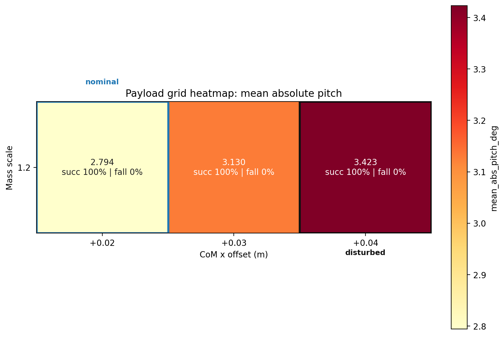
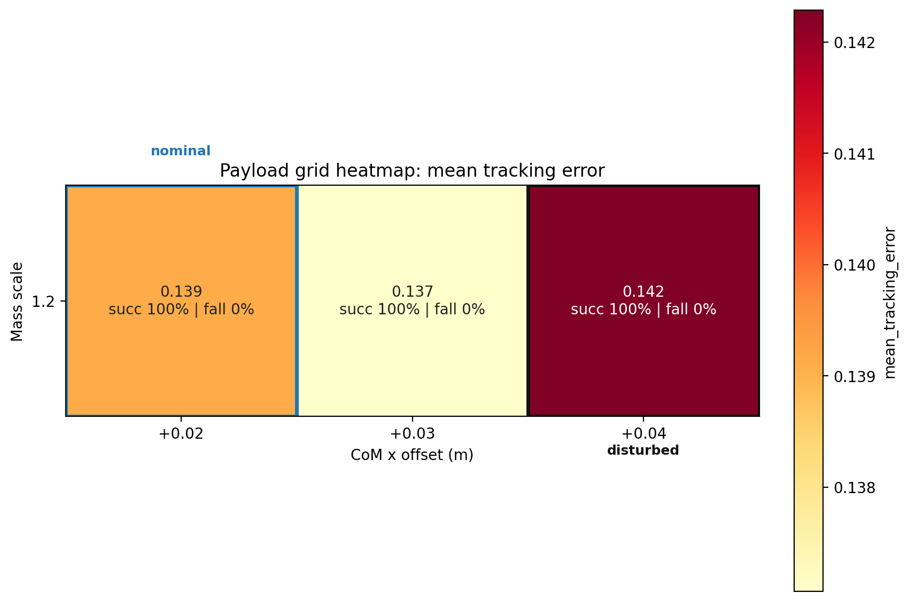
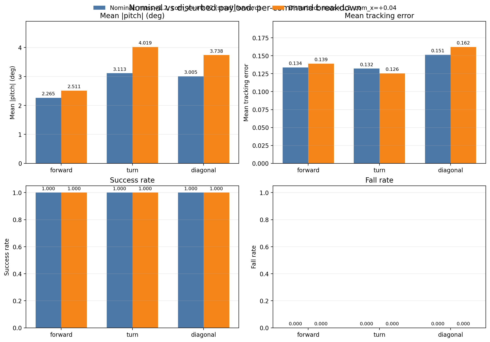

# Week 1 Payload Robustness Grid

## Scenario Summary

| scenario | mass_scale | com_x | mean_tracking_error | mean_abs_pitch_deg | peak_abs_pitch_deg | mean_action_rate_l2 | mean_torque_l2 | mean_abs_power | success_rate | fall_rate | survival_time_s |
|---|---|---|---|---|---|---|---|---|---|---|---|
| mass=1.2, com_x=+0.02 (small_forward) | 1.2 | 0.02 | 0.139 | 2.794 | 4.527 | 3.870 | 493.661 | 99.910 | 1.000 | 0.000 | 20.000 |
| mass=1.2, com_x=+0.03 | 1.2 | 0.03 | 0.137 | 3.130 | 5.170 | 3.872 | 491.257 | 99.651 | 1.000 | 0.000 | 20.000 |
| mass=1.2, com_x=+0.04 | 1.2 | 0.04 | 0.142 | 3.423 | 5.479 | 3.967 | 489.650 | 98.514 | 1.000 | 0.000 | 20.000 |

## Figures

## Payload Audit

| scenario | nominal_base_mass | applied_base_mass | nominal_base_com_x | applied_base_com_x | applied_mass_scale_vs_nominal | applied_com_x_delta |
|---|---|---|---|---|---|---|
| mass=1.2, com_x=+0.02 (small_forward) | 6.921 | 8.305 | 0.021 | 0.041 | 1.200 | 0.020 |
| mass=1.2, com_x=+0.03 | 6.921 | 8.305 | 0.021 | 0.051 | 1.200 | 0.030 |
| mass=1.2, com_x=+0.04 | 6.921 | 8.305 | 0.021 | 0.061 | 1.200 | 0.040 |

## Reference Pair

nominal: mass=1.2, com_x=+0.02 (small_forward)
disturbed: mass=1.2, com_x=+0.04

stable_degradation: True
has_degradation: True
no_collapse: True

## Per-Command Summary By Cell

## mass=1.2, com_x=+0.02 (small_forward)

| command | vx | vy | yaw | mean_tracking_error | mean_abs_roll_deg | mean_abs_pitch_deg | peak_abs_pitch_deg | mean_action_rate_l2 | mean_torque_l2 | mean_abs_power | fall_rate | survival_time_s | pass |
|---|---|---|---|---|---|---|---|---|---|---|---|---|---|
| forward | 0.8 | 0.0 | 0.0 | 0.134 | 1.484 | 2.265 | 3.296 | 4.896 | 504.047 | 110.454 | 0.000 | 20.000 | PASS |
| turn | 0.4 | 0.0 | 0.8 | 0.132 | 1.245 | 3.113 | 5.150 | 3.363 | 531.526 | 73.060 | 0.000 | 20.000 | PASS |
| diagonal | 0.5 | 0.3 | 0.0 | 0.151 | 2.692 | 3.005 | 5.134 | 3.349 | 445.409 | 116.217 | 0.000 | 20.000 | PASS |

## mass=1.2, com_x=+0.03

| command | vx | vy | yaw | mean_tracking_error | mean_abs_roll_deg | mean_abs_pitch_deg | peak_abs_pitch_deg | mean_action_rate_l2 | mean_torque_l2 | mean_abs_power | fall_rate | survival_time_s | pass |
|---|---|---|---|---|---|---|---|---|---|---|---|---|---|
| forward | 0.8 | 0.0 | 0.0 | 0.130 | 1.512 | 2.469 | 3.795 | 4.891 | 495.256 | 109.622 | 0.000 | 20.000 | PASS |
| turn | 0.4 | 0.0 | 0.8 | 0.130 | 1.196 | 3.557 | 6.059 | 3.326 | 528.048 | 73.509 | 0.000 | 20.000 | PASS |
| diagonal | 0.5 | 0.3 | 0.0 | 0.151 | 2.672 | 3.364 | 5.655 | 3.398 | 450.467 | 115.824 | 0.000 | 20.000 | PASS |

## mass=1.2, com_x=+0.04

| command | vx | vy | yaw | mean_tracking_error | mean_abs_roll_deg | mean_abs_pitch_deg | peak_abs_pitch_deg | mean_action_rate_l2 | mean_torque_l2 | mean_abs_power | fall_rate | survival_time_s | pass |
|---|---|---|---|---|---|---|---|---|---|---|---|---|---|
| forward | 0.8 | 0.0 | 0.0 | 0.139 | 1.688 | 2.511 | 4.119 | 4.994 | 483.513 | 105.504 | 0.000 | 20.000 | PASS |
| turn | 0.4 | 0.0 | 0.8 | 0.126 | 1.161 | 4.019 | 6.144 | 3.298 | 525.227 | 73.794 | 0.000 | 20.000 | PASS |
| diagonal | 0.5 | 0.3 | 0.0 | 0.162 | 2.692 | 3.738 | 6.173 | 3.609 | 460.209 | 116.243 | 0.000 | 20.000 | PASS |
