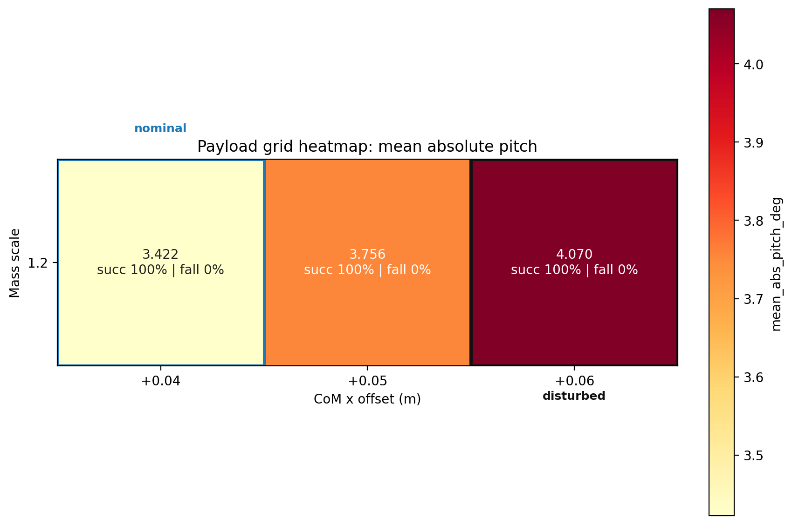
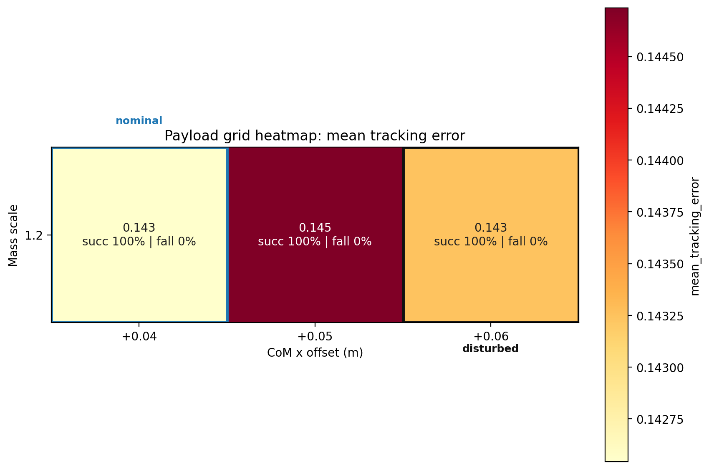
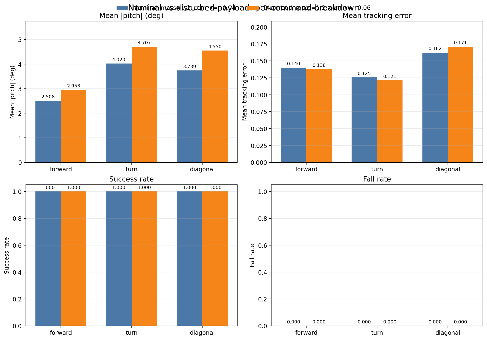

# Week 1 Payload Robustness Grid

## Scenario Summary

| scenario | mass_scale | com_x | mean_tracking_error | mean_abs_pitch_deg | peak_abs_pitch_deg | mean_action_rate_l2 | mean_torque_l2 | mean_abs_power | success_rate | fall_rate | survival_time_s |
|---|---|---|---|---|---|---|---|---|---|---|---|
| mass=1.2, com_x=+0.04 | 1.2 | 0.04 | 0.143 | 3.422 | 5.478 | 3.969 | 489.583 | 98.358 | 1.000 | 0.000 | 20.000 |
| mass=1.2, com_x=+0.05 | 1.2 | 0.05 | 0.145 | 3.756 | 5.777 | 3.999 | 488.324 | 97.128 | 1.000 | 0.000 | 20.000 |
| mass=1.2, com_x=+0.06 | 1.2 | 0.06 | 0.143 | 4.070 | 6.280 | 4.026 | 486.884 | 97.706 | 1.000 | 0.000 | 20.000 |

## Figures

## Payload Audit

| scenario | nominal_base_mass | applied_base_mass | nominal_base_com_x | applied_base_com_x | applied_mass_scale_vs_nominal | applied_com_x_delta |
|---|---|---|---|---|---|---|
| mass=1.2, com_x=+0.04 | 6.921 | 8.305 | 0.021 | 0.061 | 1.200 | 0.040 |
| mass=1.2, com_x=+0.05 | 6.921 | 8.305 | 0.021 | 0.071 | 1.200 | 0.050 |
| mass=1.2, com_x=+0.06 | 6.921 | 8.305 | 0.021 | 0.081 | 1.200 | 0.060 |

## Reference Pair

nominal: mass=1.2, com_x=+0.04
disturbed: mass=1.2, com_x=+0.06

stable_degradation: True
has_degradation: True
no_collapse: True

## Per-Command Summary By Cell

## mass=1.2, com_x=+0.04

| command | vx | vy | yaw | mean_tracking_error | mean_abs_roll_deg | mean_abs_pitch_deg | peak_abs_pitch_deg | mean_action_rate_l2 | mean_torque_l2 | mean_abs_power | fall_rate | survival_time_s | pass |
|---|---|---|---|---|---|---|---|---|---|---|---|---|---|
| forward | 0.8 | 0.0 | 0.0 | 0.140 | 1.697 | 2.508 | 4.125 | 4.999 | 483.459 | 105.062 | 0.000 | 20.000 | PASS |
| turn | 0.4 | 0.0 | 0.8 | 0.125 | 1.161 | 4.020 | 6.135 | 3.298 | 525.086 | 73.779 | 0.000 | 20.000 | PASS |
| diagonal | 0.5 | 0.3 | 0.0 | 0.162 | 2.692 | 3.739 | 6.175 | 3.609 | 460.204 | 116.232 | 0.000 | 20.000 | PASS |

## mass=1.2, com_x=+0.05

| command | vx | vy | yaw | mean_tracking_error | mean_abs_roll_deg | mean_abs_pitch_deg | peak_abs_pitch_deg | mean_action_rate_l2 | mean_torque_l2 | mean_abs_power | fall_rate | survival_time_s | pass |
|---|---|---|---|---|---|---|---|---|---|---|---|---|---|
| forward | 0.8 | 0.0 | 0.0 | 0.144 | 1.724 | 2.672 | 4.336 | 5.022 | 474.738 | 101.460 | 0.000 | 20.000 | PASS |
| turn | 0.4 | 0.0 | 0.8 | 0.123 | 1.136 | 4.448 | 6.293 | 3.290 | 523.553 | 74.629 | 0.000 | 20.000 | PASS |
| diagonal | 0.5 | 0.3 | 0.0 | 0.167 | 2.706 | 4.147 | 6.703 | 3.686 | 466.680 | 115.296 | 0.000 | 20.000 | PASS |

## mass=1.2, com_x=+0.06

| command | vx | vy | yaw | mean_tracking_error | mean_abs_roll_deg | mean_abs_pitch_deg | peak_abs_pitch_deg | mean_action_rate_l2 | mean_torque_l2 | mean_abs_power | fall_rate | survival_time_s | pass |
|---|---|---|---|---|---|---|---|---|---|---|---|---|---|
| forward | 0.8 | 0.0 | 0.0 | 0.138 | 1.689 | 2.953 | 4.722 | 4.998 | 469.203 | 105.034 | 0.000 | 20.000 | PASS |
| turn | 0.4 | 0.0 | 0.8 | 0.121 | 1.092 | 4.707 | 6.851 | 3.290 | 518.381 | 73.997 | 0.000 | 20.000 | PASS |
| diagonal | 0.5 | 0.3 | 0.0 | 0.171 | 2.723 | 4.550 | 7.268 | 3.789 | 473.069 | 114.088 | 0.000 | 20.000 | PASS |
