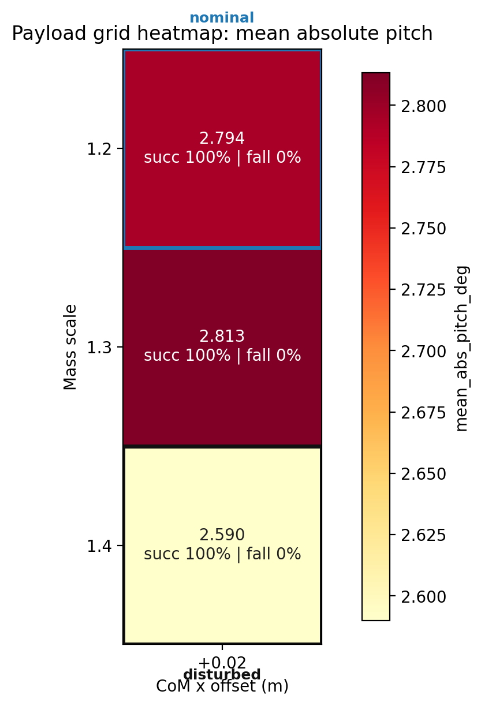
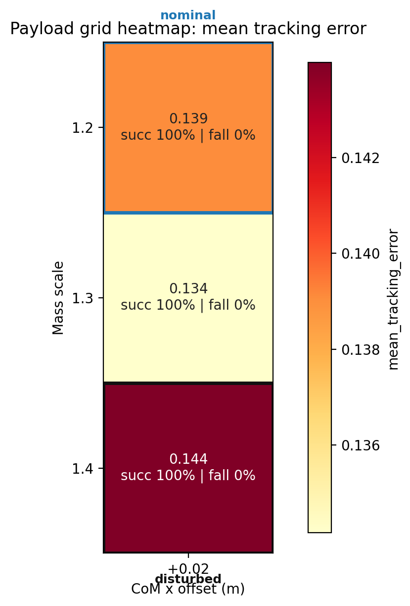
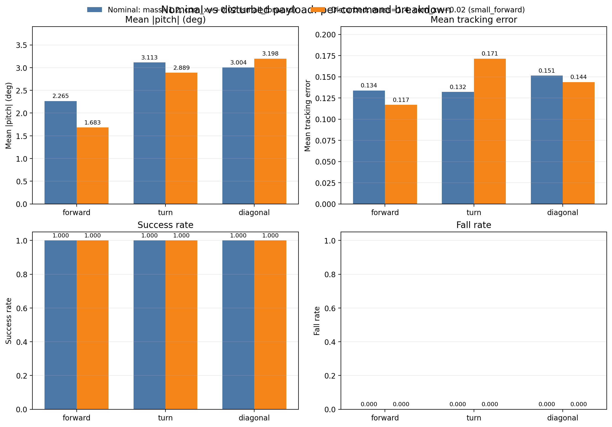

# Week 1 Payload Robustness Grid

## Scenario Summary

| scenario | mass_scale | com_x | mean_tracking_error | mean_abs_pitch_deg | peak_abs_pitch_deg | mean_action_rate_l2 | mean_torque_l2 | mean_abs_power | success_rate | fall_rate | survival_time_s |
|---|---|---|---|---|---|---|---|---|---|---|---|
| mass=1.2, com_x=+0.02 (small_forward) | 1.2 | 0.02 | 0.139 | 2.794 | 4.512 | 3.869 | 493.657 | 99.855 | 1.000 | 0.000 | 20.000 |
| mass=1.3, com_x=+0.02 (small_forward) | 1.3 | 0.02 | 0.134 | 2.813 | 4.953 | 4.125 | 532.624 | 108.015 | 1.000 | 0.000 | 20.000 |
| mass=1.4, com_x=+0.02 (small_forward) | 1.4 | 0.02 | 0.144 | 2.590 | 5.363 | 4.219 | 554.735 | 110.033 | 1.000 | 0.000 | 20.000 |

## Figures

## Payload Audit

| scenario | nominal_base_mass | applied_base_mass | nominal_base_com_x | applied_base_com_x | applied_mass_scale_vs_nominal | applied_com_x_delta |
|---|---|---|---|---|---|---|
| mass=1.2, com_x=+0.02 (small_forward) | 6.921 | 8.305 | 0.021 | 0.041 | 1.200 | 0.020 |
| mass=1.3, com_x=+0.02 (small_forward) | 6.921 | 8.997 | 0.021 | 0.041 | 1.300 | 0.020 |
| mass=1.4, com_x=+0.02 (small_forward) | 6.921 | 9.689 | 0.021 | 0.041 | 1.400 | 0.020 |

## Reference Pair

nominal: mass=1.2, com_x=+0.02 (small_forward)
disturbed: mass=1.4, com_x=+0.02 (small_forward)

stable_degradation: True
has_degradation: True
no_collapse: True

## Per-Command Summary By Cell

## mass=1.2, com_x=+0.02 (small_forward)

| command | vx | vy | yaw | mean_tracking_error | mean_abs_roll_deg | mean_abs_pitch_deg | peak_abs_pitch_deg | mean_action_rate_l2 | mean_torque_l2 | mean_abs_power | fall_rate | survival_time_s | pass |
|---|---|---|---|---|---|---|---|---|---|---|---|---|---|
| forward | 0.8 | 0.0 | 0.0 | 0.134 | 1.488 | 2.265 | 3.283 | 4.896 | 504.073 | 110.290 | 0.000 | 20.000 | PASS |
| turn | 0.4 | 0.0 | 0.8 | 0.132 | 1.244 | 3.113 | 5.136 | 3.362 | 531.383 | 73.047 | 0.000 | 20.000 | PASS |
| diagonal | 0.5 | 0.3 | 0.0 | 0.151 | 2.690 | 3.004 | 5.119 | 3.350 | 445.516 | 116.229 | 0.000 | 20.000 | PASS |

## mass=1.3, com_x=+0.02 (small_forward)

| command | vx | vy | yaw | mean_tracking_error | mean_abs_roll_deg | mean_abs_pitch_deg | peak_abs_pitch_deg | mean_action_rate_l2 | mean_torque_l2 | mean_abs_power | fall_rate | survival_time_s | pass |
|---|---|---|---|---|---|---|---|---|---|---|---|---|---|
| forward | 0.8 | 0.0 | 0.0 | 0.110 | 1.488 | 1.890 | 3.734 | 5.137 | 526.439 | 122.928 | 0.000 | 20.000 | PASS |
| turn | 0.4 | 0.0 | 0.8 | 0.137 | 1.292 | 3.347 | 5.319 | 3.549 | 575.839 | 77.497 | 0.000 | 20.000 | PASS |
| diagonal | 0.5 | 0.3 | 0.0 | 0.156 | 2.574 | 3.202 | 5.806 | 3.690 | 495.594 | 123.619 | 0.000 | 20.000 | PASS |

## mass=1.4, com_x=+0.02 (small_forward)

| command | vx | vy | yaw | mean_tracking_error | mean_abs_roll_deg | mean_abs_pitch_deg | peak_abs_pitch_deg | mean_action_rate_l2 | mean_torque_l2 | mean_abs_power | fall_rate | survival_time_s | pass |
|---|---|---|---|---|---|---|---|---|---|---|---|---|---|
| forward | 0.8 | 0.0 | 0.0 | 0.117 | 1.737 | 1.683 | 4.139 | 5.237 | 538.354 | 123.350 | 0.000 | 20.000 | PASS |
| turn | 0.4 | 0.0 | 0.8 | 0.171 | 1.336 | 2.889 | 5.697 | 3.641 | 601.332 | 78.876 | 0.000 | 20.000 | PASS |
| diagonal | 0.5 | 0.3 | 0.0 | 0.144 | 2.460 | 3.198 | 6.252 | 3.779 | 524.518 | 127.874 | 0.000 | 20.000 | PASS |
